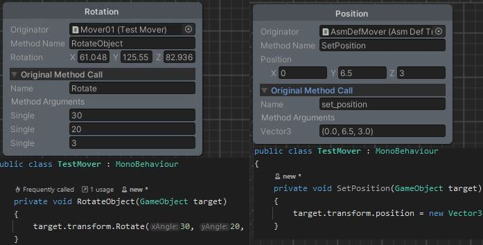
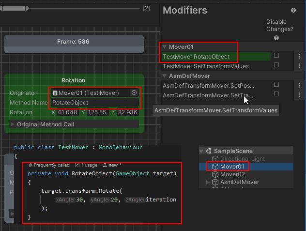
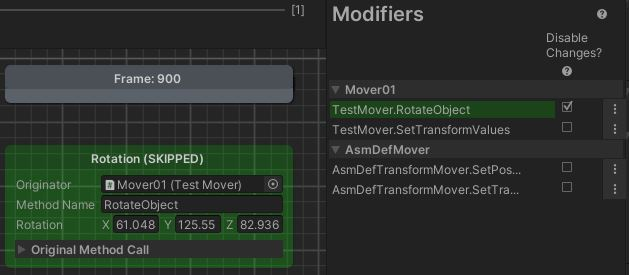
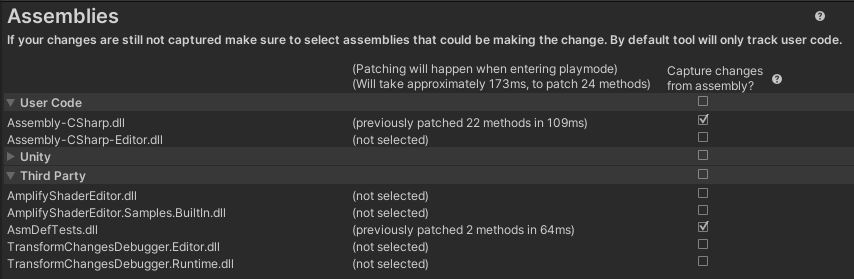
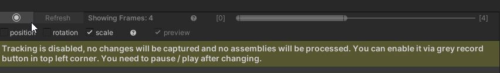

# Transform Changes Debugger API

This tool will enable you to view and debug changes to position/rotation/scale on **any** transform done by **any** method/setter on a frame by frame basis. 

It'll will work with code that executes changes via property setters (eg `Transform.position = newValue`) but also more complex methods (eg `Transform.Rotate(1f, 230f, 15f, Space.Self)`).

Changes can be originating from **any** assembly - not only your code but also 3rd party libraries or Unity assemblies.

There are 4 core features that this documentation goes into more detail:

1) View changes to position/rotation/scale of any transform in easy to use GUI on a frame-by-frame basis [(more details)](#viewing-change-details)
2) Identify and view specific `TransformModifiers` (specific game object instance and script/method combination that initiated 
change (eg. Mover-1-GO via TestMove.cs script, method MoveTransform()) [(more details)](#modifiers-details)
3) Enable you to easily skip changes originating from specific `TransformModifiers` (at runtime, without need to recompile) - 
this means you can identify offending code by isolating specific changes [(more details)](#temporarily-skipping-specific-changes-at-runtime)

> **The best place to start are demo scenes, 1st one 'HardToPinpointIntermittentJitter' will show you all that's needed to start tracking**

# API and Full GUI Tool
Code in this repository is core API used in full tool that has an easy to use and intuitive GUI built on top.

You can see tool in action on this quick 1 minute video - it'll show you what's possible with the API.
[](https://youtu.be/6YjrgHpE2x4 "Play")

> I've put a lot of time to make the end tool fast and easy to use. If API is of use to you - full GUI tool will save you a lot of time.

> Please consider purchasing the full GUI enabled version direcly on site or via Unity Store if you'd like to support development!

[Transfor Changes Debugger GUI - Website](https://immersivevrtools.com/projects/transform-changes-debugger)

*Scrennshots are from GUI version althought they are still relevant as they show what API can do.*

# Setup / Quickstart

**Have a look at HardToPinpointJitter scene HardToPinpointJitterDebugger.cs script - those will give you basic idea how API can be used.**

1) Add `TrackTransformChanges` script to objects you want to tracked
2) Initialize tracking:
```
    TransformChangesDebuggerManager.IsTrackingEnabled = true;
    TransformChangesDebuggerManager.Initialize(allAvailableAssembliesToPatch, userChosenAssembliesToPatch);
```

# Viewing Change Details


All changes done in any frame can be retrieved via  `TransformChangesTracker.GetFrameChangesForTrackedObject` and will provide:
- `Originator` - script instance that the change originated in. **[click to see it in Hierarchy View]**
- `MethodName` - actual method in the script where the change originated. **[right click on the node title and choose 'goto code' to view the method in your code editor]**
- `Rotation` \ `Position` \ `Scale` - (changes depending on node type) - value after the change has been made
    - `ValueBeforeChange` can be retrieved from code  [(see API details)](#transformchange)
- `Original Method Call` - actual method call that caused transform change
    - `Name` - the name for method, in case of setters this will be set_xxx
    - `Method Arguments` - arguments passed to method

## Relevant API
`TransformChangesTracker.GetFrameChangesForTrackedObject`

# Modifiers Details


Changes visible on screen are grouped by `TransformModifier` - that is a specific change to object that originated from specific **game object instance** 
via **script** using **specific method**. This panel breaks them down to better illustrate which objects are changing tracked transform.

For example one of `TransformModifiers` on the screenshot is `Mover01` game object that's modifying tracked object via `TestMover` script, 
in `RotateObject` method.

## Relevant API
`TransformChangesTracker.GetModifiers`

# Temporarily Skipping Specific Changes at Runtime


The tool will allow you to quickly isolate `TransformModifiers` that could be causing issues - this can be done by temporarily disabling 
changes made by them. 

Simply tick the 'disable changes' checkbox next to the modifier and resume the game. **Any change made by modifier will now be skipped.** The actual change node
will still be registered by the tool and the title will indicate that it was 'SKIPPED'

## Relevant API
`TransformChangesDebuggerManager.SkipTransformChangesFor`


# Capturing Changes - Configuring Sources / Assemblies Bar


The tool will find all calls to any transform modifying methods (eg setters [`set_position`, `set_rotation`] but also more complex
methods like `Transform.Rotate(1f, 230f, 15f, Space.Self)`). This happens directly in memory so no assembly files are actually modified.
This process can add some time to entering play mode.

By default only changes originating from your own `User Code` - `Assembly-CSharp.dll` will be captured. Of course, this can not be enough if change 
originates from say 3rd party library.

You can use the bottom Assemblies bar to configure which assemblies should be included. Simply use the tick box next to the name.

## Relevant API
You configure assemblies that are patched with initial `TransformChangesDebuggerManager.Initialize` call.
Later you can also patch assembly at runtime via `TransformChangesDebugger.API.TransformChangesDebuggerManager.EnableChangeTracking`

# Performance
When you're processing assembly for the first time - tool needs to find all the methods that should be patched. That's most time-expensive part of the process but it
only happens once (as long as assembly is not recompiled) - that means 3rd party / Unity libraries need to execute 'find' step just once to build cache.
After that, search step is not executed and instead only patching happens - which is much quicker. If patched assembly is recompiled tool will also re-run search step and update cache.

You can see performance statistics around patching times to help you decide if specific library is needed.

This greatly improves workflow and helps keep entering play-mode time well under 0.5s.

>**Assemblies will be only processed if there's at least 1 `TrackTransformChanges` script in the scene, you can have the tool imported into the
project ready to be used without any performance cost if you're not using it.**

## Quickly Disable Tool to Save Time


You can very easily turn whole patching process off by turning the tool off with 'record' button in top bar. 

## Relevant API
`TransformChangesDebugger.API.TransformChangesDebuggerManager.IsTrackingEnabled`

# API Usage - Advanced
The tool exposes easy to use and documented API that you can use directly. Following section will document what's possible.

## Adding Custom Code to Handle Changes
You can execute custom code in response to any tracked change. The easiest way to do that is to use UnityEvents on `TrackTransformChanges`, 
`PositionChanged`, `RotationChanged` and `ScaleChanged`. They give you access to `TransformChange` which has change data ([API Reference](#transformchange))

You can also use `TransformChangesDebuggerManager.RegisterCallbackFor[Position/Rotation/Scale]Changes` to register your custom callback. 
Eg. have a look at `ApiUsageExamples.cs`

```
TransformChangesDebuggerManager.RegisterCallbackForPositionChanges(InterceptFor,
    (ilWeavedValues, newValue) =>
    {
        Debug.Log($"Intercepted scale change: {newValue} " +
                    $"{ilWeavedValues.CallingFromMethodName} {ilWeavedValues.CallingObject?.name ?? "StaticCall"} " +
                    $"{ilWeavedValues.ChangeType}");
    }
);
```
Will produce following result on changes:
```
Intercepted scale change: (0.0, 0.0, 0.0) TestMover.SetTransformValues() Mover02 Scale
Intercepted scale change: (1.0, 1.0, 1.0) TestMover.SetTransformValues() Mover02 Scale
Intercepted scale change: (2.0, 2.0, 2.0) TestMover.SetTransformValues() Mover02 Scale
```

## Skipping Specific Changes
You can have more control over which changes are skipped (at runtime) by calling `TransformChangesDebuggerManager.SkipTransformChangesFor` and 
passing `ShouldSkipTransformChangeExecutionPredicate`.

For eaxample following setup would skip any changes made to object named `DoNotChangeIfCallingFromSpecificMethod` when change is coming from method name `TestMover.SetPosition`.

```
TransformChangesDebuggerManager.SkipTransformChangesFor((ilWeavedValuesArray, changingComponent) =>
{
    if (changingComponent.name == "DoNotChangeIfCallingFromSpecificMethod" && ilWeavedValuesArray.CallingFromMethodName == "TestMover.SetPosition")
    {
        return true; //true will indicate that change should be skipped
    }
    return false;
});
```

> To unregister you simply call `TransformChangesDebuggerManager.RemoveSkipTransformChangesFor` passing in the same predicate.

## Enable/Disable Tool
Change `TransformChangesDebuggerManager.IsTrackingEnabled`

# Drawbacks / Limitations

## Physics
Currently physics (eg changes done via `Rigidbody` or gravity) will be treated as mismatch. If you're debugging transform that's misbehaving then it's best
to temporarily turn gravity off. If physics is indeed the cause of the issue then this tool will not be able to help you at this point.

**Please let me know if that's important to you, while it's not officialy supported I'll look into improving that part if there's enough interest.**

## Debugging Original Code
When tool is enabled, calling code will be adjusted in memory that means you won't be able to hit breakpoints in some of affected code.

For example in following scenario debugger will not break if you set breakpoint anywhere in SetPosition method.
```
private void SetPosition(GameObject target) 
{
    target.transform.position = new Vector3(iteration2, iteration +3.5f, iteration);

    //you won't be able to add breakpoint to this method
    var calculation = 1 + 2;
}
```

You'll however be able to hit breakpoints in calling code, eg 
```
public void SetTransformValues()
{
    foreach (var target in SetTargets)
    { 
        SetPosition(target);
    }
}
```

This is due to the fact that methods that modify transform (be it via setters or via method calls) will have their IL instructions rewritten. In that case `SetTransformValues()` method 
will actually make a call to dynamically patched method `SetPosition_Patch0(target)` - with that change your breakpoint is simply never hit.

**You can very simply turn the tool off once you found the issue and breakpoints in affected code will work again.**

## Prod Build Support / Non Editor Usage
The core API that enables transform change tracking is fully independent of UnityEditor. You can use it in build and it'll work.
`AdvancedAPIUsage` demo shows how easy that interception can be configured without using any parts of GUI. 

However the tool development was focused on funtionality
rather than prod-required performance. You can find that in bigger solutions additional code executed affects performance (and additional IL code affects DLL size). This is
to be expected. Currently I'd not recommend using it in production build.

**Please let me know if that's important to you, while it's not officialy supported I'll look into improving that part if there's enough interest.**

## Concurrency
Currently changes will only work if transforms are adjusted on main/single thread.

**Please let me know if that's important to you, while it's not officialy supported I'll look into improving that part if there's enough interest.**

## Method changing more than 1 property
Methods that are changing more than 1 property (position/rotation/scale) will be captured as change to position.

## No support for NET Standard 2.0
No support for NET Standard 2.0 API Compatibility level - currently you have to use .NET 4.x

For example:
`Transform.SetPositionAndRotation()` - will be rendered as a position change, where rotation will be skipped entirely (you'll still get correct information about method and method arguments)

# API Reference

## TrackTransformChanges
Add this class to game objects that changes you want to be tracked.

- `PositionChanged` - Fired on every tracked position related change, could be used to pinpoint exact change that's causing issue in a programmatic way 
- `RotationChanged` - Fired on every tracked rotation related change, could be used to pin point exact change that's causing issue in programmatic way 
- `ScaleChanged` - Fired on every tracked scale related change, could be used to pin point exact change that's causing issue in programmatic way 
- `HandlePositionChange` - Fired on every tracked position related change, override in derived class for custom handling 
- `HandleRotationChange` - Fired on every tracked rotation related change, override in derived class for custom handling 
- `HandleScaleChange` - Fired on every tracked scale related change, override in derived class for custom handling 

## TransformChange
Details about specific change to transform.

- `CallingObject` - Object that initiated the change 
- `CallingFromMethodName` - Method name where the change originated 
- `TrackedDueToInterceptedMethodCallFullName` - Full method name that originally caused transform change, eg. `UnityEngine.Transform.set_position(UnityEngine.Vector3)` or `UnityEngine.Transform.Translate(UnityEngine.Vector3)`. Full list can be found in class `TranspiledMethodDefinitions` 
- `TrackedDueToInterceptedMethodArguments` - Method arguments passed in to original changing method, eg for `UnityEngine.Transform.Rotate(UnityEngine.Vector3,UnityEngine.Space)` that could be { (0, 1, 2), Space.Self } 
- `NewValue` - New value after change's been made 
- `ValueBeforeChange` - Value right before change was made 
- `ChangeType` - ChangeType - either position/rotation/scale 
- `ChangedInFrame` - Frame index when change occured 
- `ModifiedObject` - Object which transform has been modified 
- `WasChangeSkipped` - Indicates whether change was not made as it was skipped at runtime due to skip setup
- `PreviousSameTypeChange` - Previous tracked change of same type, this can be traversed to create a chain of changes of same type in reversed order
- `IsMismatchWithPreviousChange` - Indicates whether last change new value is different than current change's `ValueBeforeChange` which likely means there's a change that happened and was not captured 

## TransformChangesDebuggerManager
Manager class that allows to control all backend aspects of transform change tracking, change skipping and assembly patching

- `IsTrackingEnabledChanged` - Fired when global change tracking was enabled/disabled 
- `IsTrackingEnabled` - Controls change tracking for whole, if disabled no assemblies will be patched and no callbacks will be executed 
- `Initialize` - Initializes change tracking by patching selected assemblies, call is only needed if you're not using default `TransformChangesDebuggerInitializer` 
- `EnableChangeTracking` - Allows to enable change tracking for selected assemblies at runtime 
- `RegisterCallbackForPositionChanges` - Allows to respond to position changes to specific object by executing handler 
- `RegisterCallbackForScaleChanges` - Allows to respond to scale changes to specific object by executing handler 
- `RegisterCallbackForRotationChanges` - Allows to respond to rotation changes to specific object by executing handler 
- `RemoveCallback` - Removes previously created callback for changes to object 
- `SkipTransformChangesFor` - Allows to skip specific changes at runtime for intercepted method calls. This is useful for eg. in debugging scenarios to narrow down which changes cause issues 
- `SkipTransformChangesFor` - Allows to skip specific changes at runtime for intercepted method calls. This is useful for eg. in debugging scenarios to narrow down which changes cause issues 
- `RemoveSkipTransformChangesFor` - Removed previously added predicate, effectively re-enabling changes 
- `RemoveSkipTransformChangesFor` - Removed previously added modifier, effectively re-enabling changes 

## TransformChangesTracker
This class captures and makes sense of data captured for objects with `TrackTransformChanges` on a frame-by-frame basis

- `OnTransformChangeAdded` - Fires when new transform change has been captured for tracked object 
- `KeepChangesDataForMaximumNumberOfFrames` - Maximum number of frames that data will be kept for. For performance reasons it's best to keep that within reasonable limits. 
- `TrackChanges` - Starts tracking changes for specific object. This method needs to be called if subclassing 
- `StopTrackingChanges` - Stops tracking changes for specific object 
- `GetTrackedObjects` - Gets list of all tracked objects that there's any captured data for 
- `GetTrackedObjects` - Gets list of all tracked objects that have tracking data for specific frame 
- `GetFrameChangesForTrackedObject` - Resolves changes for specific frame and specific object 
- `GetFrameChanges` - Resolves changes to all tracked object in specified frame 
- `GetModifiers` - Gets all entries for tracked changes 
- `GetModifiers` - Gets all entries for tracked changes in specific frame 
- `GetModifiers` - Gets all entries for specific object 
- `GetModifiers` - Gets all entries for tracked changes in frame

# Acknowledgements
The tool is build with [Harmony](https://github.com/pardeike/Harmony) a great library that's making assembly runtime patching much simpler.
